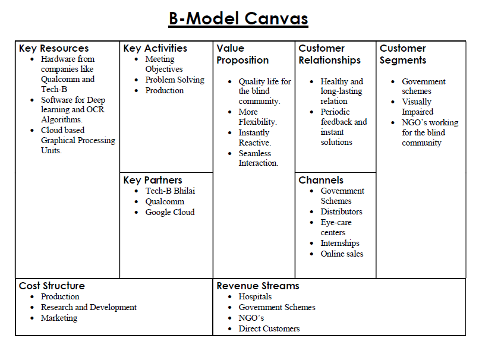
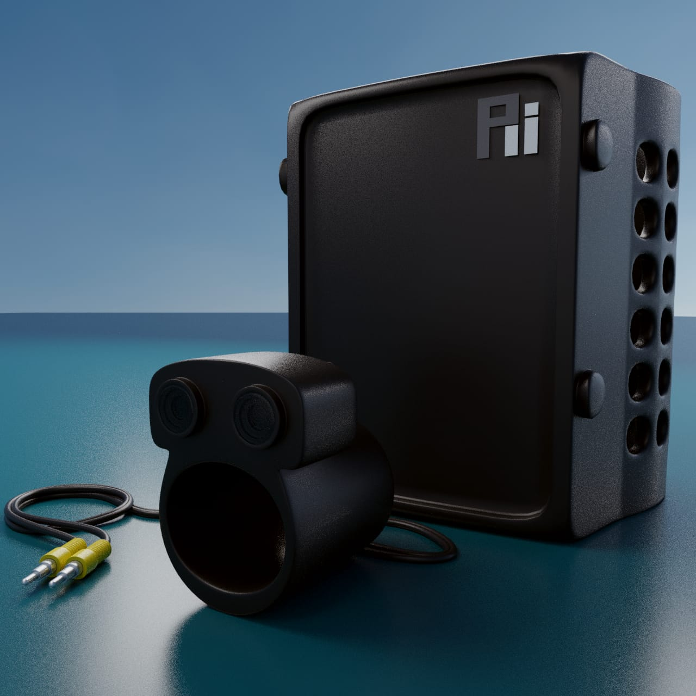
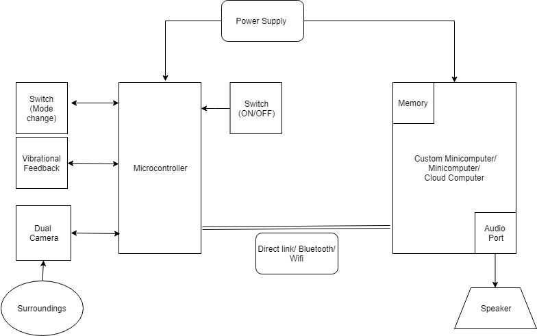
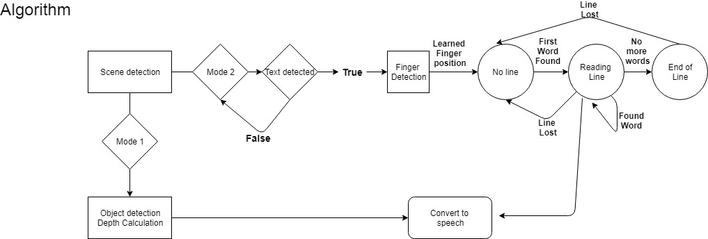
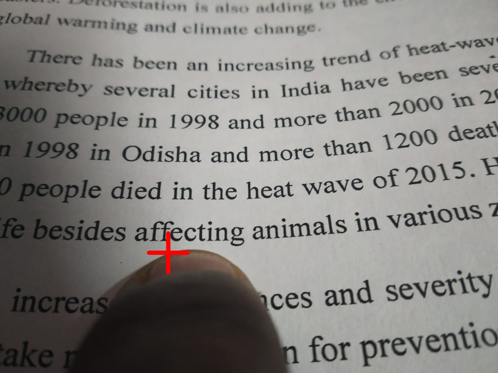
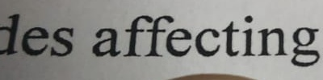
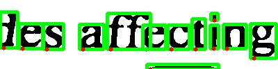

- Buisness Canvas

Here is the detailed Business Canvas that we proposed for our device.

- Device 3D Desgin in Blender

- Hardware Overview

- Software Overview (Algorithmic Flow)

- Image-Processing
Here's the image captured by the camera, which is given as input to the algorithm.

The finger is detected and the other regions of the image are masked.

The tip of the finger is detected, identifying the point for the line detection algorithm. The nearby text is processed and passed to the line detection algorithm, enabling the detection of a series of letters, and hence word in the given line.
  

 

The bounding box is generated, and the words are read and sent to the TTS algorithm for further processing.

Link to TTS functionality in a given example: 

